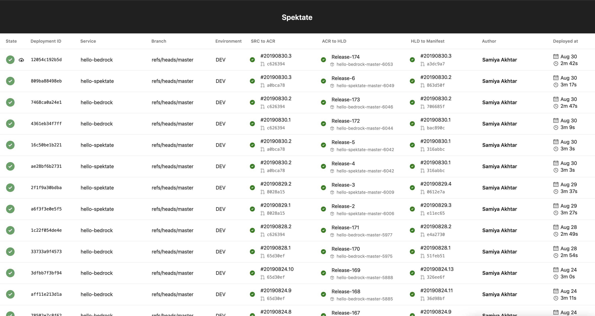
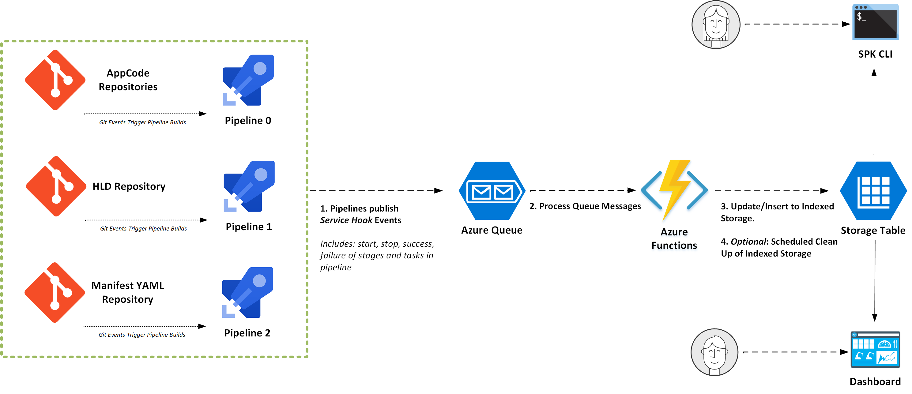
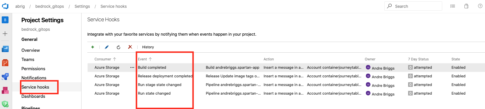

# AzDO Service Hooks As A Changelog To Enable Service Introspection In Bedrock

This repository covers an alternative approach to decorating Azure Devops Pipelines with metadata to achieve knowledge of the status of a GitOps flow using [Bedrock](aka.ms/bedrock) patterns.

## What is Spektate?
[Spektate](https://github.com/Microsoft/spektate) is a dashboard tool to allows a holistic view of container based applications as they flow from source code to container registries to _high level definition_ repositories, _manifest_ repositories and finally Kubernetes cluster deployment. 



## What is SPK?

[SPK](https://github.com/CatalystCode/spk) is a CLI tool that helps automate cloud infrastructure and service management. Moreover, SPK provides _service introspection_. Spektate and SPK overlap in the _service introspection_ area and will eventually merge.

## Why do we want an alternative method to retrieve CI/CD metadata?
Spektate requires a client must modify their existing `azure-pipelines.yaml` file in order to decorate telemetry information. This telemetry is recorded at the beginning and end of Azure pipeline runs. The recorded data is sent to indexed storage. The key point is that a user must add this telemetry explicity modify their production configuration. 

The also must do this for each new pipeline they wish to add. That means if a client has 12 microservices across 12 pipelines each `azure-pipelines.yaml` file must be tediously decorated! 😬

## How would we achieve less coupling and a better onboarding experience?



The diagram above has can be read through the following steps:

1. Developers make changes to various Git repositories
2. Git repository changes trigger associated Azure Pipelines
3. Azure DevOps is configured via service hooks to post JSON messages in an Azure Queue
4. An Azure Function is configured to be queue triggered and listen for enqueued messages
5. The Azure Functions processes the messages against the indexed storage and determines whether to add or update records.
6. The SPK CLI or the Spektate Dashboard can consume information about where applications are in the CI/CD pipeline. 

**TLDR;** Essentially we use the service hooks feature of Azure DevOps as a changelog publisher. We subscribe and process to changes to pipeline state and metadata that are logged.

This leads to several benefits:
- Better Spektate onboarding user experience 🍻
- Less coupling to custom solutions. 🙅🏾‍♂️
- All pipelines funnel into one place. ⛳️
- Allow SPK service introspection to evolve separately from "client code" 🗿
- Easier testing 🥳

## How would we deploy this approach?

All cloud infra (Azure DevOps Project, Azure Storage pieces, Azure Function) can be deployed by SPK. The Azure DevOps project and the Azure Queue are decoupled from the rest of the solution. This means service introspection can easily be added to existing Azure DevOps projects.

We can use the Azure DevOps API to [programmatically](https://docs.microsoft.com/en-us/rest/api/azure/devops/hooks/subscriptions/create%20subscriptions%20query?view=azure-devops-rest-5.1) create service hooks that map to the Azure Storage:


## What type of management needs to be maintained for this approach?

The introduction of queues means one must deal with all the issues of queues (expiration, dead letter queues, etc). The processor (Az Functions) must be idempotent and must use defensive coding techniqiues when updating and inserting against the indexed storage layer. The indexed storage layer must be cleaned up after a while.

## Caveats with this approach
The main issue in my investigation is that the existing Spektate is able to retrieve the latest Git commit id of the _manifest repo_. Technically the manifest repo isn't connected to a pipeline, but rather is an imported artifact of _HLD_ repository.

See Step 4 for [Spektate Onboarding](https://github.com/Microsoft/spektate#onboard-a-bedrock-project-to-use-spektate):
<pre>
- script: |
    cd "$HOME"
    cd hello-bedrock-manifest
    <b>latest_commit=$(git rev-parse --short HEAD)</b>
    cd ../spektate/pipeline-scripts
    source venv/bin/activate
    echo "python update_pipeline.py $(ACCOUNT_NAME) $(ACCOUNT_KEY) $(TABLE_NAME) $(PARTITION_KEY) p3 $(Build.BuildId) manifestCommitId $latest_commit"
    python update_pipeline.py $(ACCOUNT_NAME) $(ACCOUNT_KEY) $(TABLE_NAME) $(PARTITION_KEY) p3 $(Build.BuildId) manifestCommitId $latest_commit
  displayName: Update commit id in database
</pre>

What this means is that **latest_commit** above will not be in any service hook JSON payload since it is a custom point in time variable. The above snippet is appended to a client's _azure-pipelines.yaml_ file.

There are ways to get around this but they involve creating [artifacts](https://docs.microsoft.com/en-us/azure/devops/artifacts/overview?view=azure-devops&viewFallbackFrom=vsts) or modifiying a customer's existing YAML file. We can also find ways to get the commit id of the manifest repository in a more passive way (outside of the Azure pipeline process). 

Another caveat is that one can argue more complexity is introduced with the  moving pieces with Azure Functions and Queues. One must wieght the benefits of decoupling with more components. 

## Examples of Service Hook Event Payloads
Below are examples of the JSON payloads that Azure DevOps sends to the queue. We us the `jq` tool to parse the payloads and extracts relevant data that would be stored in indexed storage. One could imagine how an Azure Function would extract data from the JSON queue messages.

These examples use JSON files that are in this repository.

### Build Started

`$ cat example-json/started_build.json | jq '.eventType, .createdDate, .message.text, .resource.run.pipeline.id,.resource.run.name, .resource.run.id'`
```
"ms.vss-pipelines.run-state-changed-event"
"2019-10-02T19:54:00.3307136Z"
"Run 20191002.2 in progress."
7
"20191002.2"
479
```

### Build Ended

`$ cat example-json/completed_build.json | jq '.eventType, .createdDate, .message.text, .resource.definition.id, .resource.buildNumber, .resource.id'`

```
"build.complete"
"2019-10-02T19:57:48.7584186Z"
"Build 20191002.2 succeeded"
7
"20191002.2"
479
```

### Stage State Change

`$ cat example-json/stage_state_change.json | jq '.eventType, .createdDate, .message.text, .resource.pipeline.id,.resource.stage.name, .resource.run.id'`

```
"ms.vss-pipelines.stage-state-changed-event"
"2019-10-02T20:10:39.1376851Z"
"Run 20191002.3 stage build running."
7
"build"
480
```


### Example of Get Build Id API Result JSON

`$ cat example-json/get_build_id_api_result.json | jq '.status, .buildNumber, .result,.startTime,.finishTime'`

```
"completed"
"20191002.4"
"succeeded"
"2019-10-02T21:56:04.844615Z"
"2019-10-02T22:00:04.8462149Z"
```

